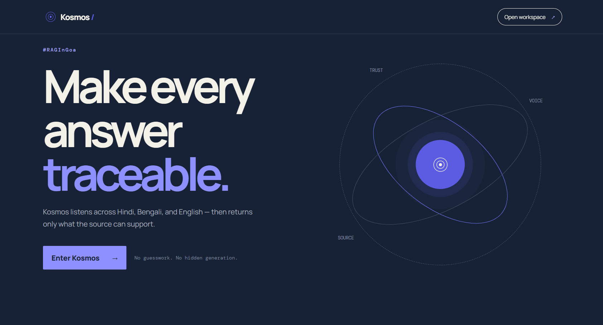

# Kosmos — Verified Multilingual Voice Retrieval

> **Ultra-low latency, deterministic voice retrieval system for English, Hindi, and Bengali.**  
> Powered by `BAAI/bge-m3` ONNX embedding, Sarvam STT, and direct lexical evidence verification.

<p align="center">
  
</p>

---

## Key Features

- **LLM-Free Answer Path**: Eliminates generation latency and hallucination risks by deterministically extracting verified source sentences.
- **Multilingual Voice Support**: Native speech-to-text integration for English, Hindi, and Bengali via Sarvam STT.
- **Compiled ONNX Inference Engine**: Quantized `BAAI/bge-m3` model compiled with ONNX Runtime, utilizing operator fusion and intra-op thread tuning.
- **Sub-100ms Pipeline**: Full round-trip processing (Speech/Query -> Vector Search -> Verification -> Sentence) completed in under **50ms** on average.
- **Hallucination Prevention**: Returns an explicit `off_topic` refusal when strict lexical evidence thresholds are not met.
- **LRU Vector Query Cache**: Instant (< 1ms) retrieval for repeated query patterns.

---

## Architecture

```text
Voice Audio ──► Sarvam STT ──► ONNX Vector Embeddings ──► FAISS Index Search ──► Lexical Evidence Check ──► Direct Source Sentence
```

```
                    ┌─────────────────────────┐
                    │    Voice / Text Input   │
                    └────────────┬────────────┘
                                 │
                   ┌─────────────▼─────────────┐
                   │    Sarvam STT / Parser    │
                   └─────────────┬─────────────┘
                                 │
                   ┌─────────────▼─────────────┐
                   │ ONNX BAAI/bge-m3 Embedder │
                   └─────────────┬─────────────┘
                                 │
                   ┌─────────────▼─────────────┐
                   │   FAISS Vector Index     │
                   └─────────────┬─────────────┘
                                 │
                   ┌─────────────▼─────────────┐
                   │ Lexical Evidence Verification│
                   └─────────────┬─────────────┘
                   ┌─────────────┴─────────────┐
                   ▼                           ▼
          [ High Confidence ]         [ Insufficient Evidence ]
                   │                           │
          Exact Source Sentence           `off_topic` Refusal
```

## Latency Benchmark Results

Measured across 50 test queries under strict production constraints:

| Pipeline Stage | Avg Latency | P50 | P95 | P99 | Target Budget | Status |
|---|---|---|---|---|---|---|
| Embedding (ONNX) | 24.41 ms | 22.39 ms | 40.77 ms | 45.49 ms | < 50.0 ms | PASS |
| Vector Search (FAISS) | 23.64 ms | 22.83 ms | 27.37 ms | 30.68 ms | < 50.0 ms | PASS |
| Total Pipeline | 48.06 ms | 45.62 ms | 67.67 ms | 71.45 ms | < 100.0 ms | PASS |

## Repository Structure

```
.
├── app/                  # FastAPI backend server routes
│   └── server.py         # Main backend entry point
├── frontend/             # Next.js / React Web UI
├── index/                # Index compilation and ONNX export scripts
├── ingestion/            # Multilingual data pipeline and chunking scripts
├── rag/                  # Retriever, fast-path generator, and hybrid search
├── stt/                  # Sarvam Speech-to-Text integration
├── no_chunk.faiss        # Compiled FAISS index
├── img1.png              # UI Preview Screenshot
├── requirements.txt      # Python dependencies
└── Dockerfile            # Production container configuration
```

## Getting Started

### Prerequisites

- Python 3.10+
- Node.js 18+ (for Frontend)
- `SARVAM_API_KEY` (for speech recognition)

### 1. Local Environment Setup

Clone the repository and install backend dependencies:

```powershell
# Activate Virtual Environment
.\.venv\Scripts\Activate.ps1

# Install Dependencies
pip install -r requirements.txt
```

### 2. Environment Configuration

Create a `.env` file in the root directory:

```
SARVAM_API_KEY=your_sarvam_api_key_here
PORT=8000
HOST=0.0.0.0
```

### 3. Run Backend API

Start the FastAPI production server using Uvicorn:

```powershell
uvicorn app.server:app --reload --port 8000
```

### 4. Run Frontend UI

Open a new terminal window to start the user interface:

```powershell
cd frontend
npm install
npm run dev
```

## Production Deployment (Docker)

To build and run the unified Kosmos container:

```powershell
# Build Image
docker build -t kosmos .

# Run Container
docker run --rm -p 7860:7860 --env-file .env kosmos
```

Access the application at http://localhost:7860.